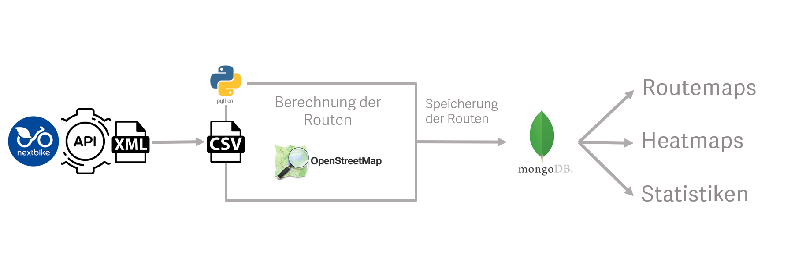
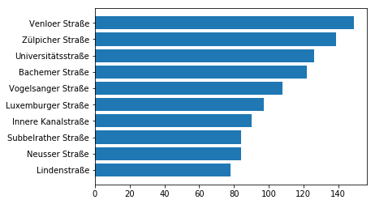

# Bikesharing-Geoanalysis
Crawled OpenData from a Bikesharing-Company and analysed it with the help of Python osmnx and folium

You will need the Pythonmodule [**OSMnx**](https://github.com/gboeing/osmnx) to perform the geolocation and calculate the routes.

# Overview

We crawled the [Nextbike-Api](https://open.nrw/dataset/standorte-fahrradverleih-koeln-kvb-rad-k) for the GPS Data of the Bikesharing Bikes in Cologne. You can find a <a href="2018-11-18%2Bbikes.csv" target="_blank">sample csvfile</a> with data from one day in this repository.

With the help of **OSMnx** we can analyse the geolocations of the bikes and calculate the routes they are driving.

Also we can save the calculated routes into a database to make later analysis on a bigger timerange.

 

The functions used in the [main.ipynb](main.ipynb) are stored in [processes.py](processes.py)

So after loading the csvfile as a dataframe we can calculate the routes with **transform()** which returns a python dictionary giving us a lot of freedom to process the data in next the steps. This will take some minutes since the calculating of the routes is very timeintensive.

`routes = ps.transform(df)`

The funcion **pltfromdoc()** reads the dictonary and plots the graph of cologne and paints the routes from the dictionary.
The image will be saved into [/images/graphbikes.png](/images/graphbikes.png)

`ps.pltfromdoc(routes)`
  

The function **heatfromdoc()** creates a heatmap with timeseries, the stepwidth is set to an hour but you can change the stepwidth by adjusting the cnt (6=1h, 12=2h) inside the function.
Check also the [index.html](index.html) for the interactive map.

`ps.heatfromdoc(routes)`
  

The function pltStreetCount() is a sample analysis on the data that counts the used streets in the route data and displays the top 10

`ps.pltStreetCount(routes)`
 
